[← Back to Home](Home)

# OpenEditor — Developer Handbook (Proposed Revision)

> Documentation for the team building OpenEditor on top of the CopyBot codebase.
> Covers the target architecture, the revised processing pipeline, the Track C/D
> work plan, a service inventory with disposition, and an end-to-end flowchart.

---

## 1. What Changed vs. CopyBot

| Area | Legacy (CopyBot) | Revised (OpenEditor) |
|---|---|---|
| Target | JUTLP manuscripts only | Any author's `.docx`, generic APA 7 |
| Template knowledge | `app/domain/*` JUTLP template/guidelines/style map | New `app/domain/apa7_*` set, APA base .docx |
| Validation | `jutlp_validator` (JUTLP rules SEC/MET/DIS/FP…) | `apa7_validator` (APA001–APA012) |
| Front-page builder | `output_generation_samfix` JUTLP rules | APA title-page/abstract/references normalisation |
| LLM prompts | JUTLP guidelines + JUTLP few-shots | APA 7 guidelines + APA few-shots, APA categories |
| Spelling | Australian EN forced | Configurable `SPELLING_VARIANT` (default per client) |
| Appendices | Banned (JUTLP rule) | Allowed; `Appendix A` labelling |
| Carousel | JUTLP articles feed | Removed |
| Access | MemberPress/Stripe stubs + password gate | Password gate only; MemberPress/Stripe code stays but unused |

---

## 2. Revised Pipeline (`app/pipelines/feedback_gen_pipeline.py`)

```
Upload → Guards → Normalise → [Deterministic ∥ Reference] → LLM review
       → Assembly → Correction passes → Reference cluster → Finalise → Results/Download
```

### Stage A — Upload & guards (`app/main.py`)
Unchanged: auth gate, rate limit, `.docx` check, word-count gate, session thread, poll, cancel, timeout.

### Stage B — Phase 0: Normalisation
Keep `normalise_docx`; strip JUTLP-specific bits (`GUIDANCE_NOTES_STYLE` deletion now targets generic template junk only).

### Stage C — Phase 1: Parallel deterministic analysis
- `apa7_validator.validate` — margins, double spacing, allowed fonts, left-align, first-line indent, page numbers, title-page structure, abstract/keywords labels, heading-level inventory, references block, tables/figures numbering, 40-word block quotes.
- `reference_checker.check_and_report` — unchanged (CrossRef + cache).

### Stage D — Phase 2: LLM editorial review (Track D)
- `prompt_builder` with APA system prompt, APA categories, APA few-shots.
- `llm_client` — same wrapper; `category` becomes enum of APA categories; `structural_validations.verdict` gains `"needs_review"`.
- Deduplication guard vs. automated results retained.

### Stage E — Phase 3: Assembly
- `output_generation.generate_commented_docx` — anchors kept; JUTLP anchor table replaced by APA section map.
- APA front-page pass replaces `build_edited_document`'s JUTLP steps (banner/textbox/practitioner/keywords/citation-footer removed).

### Stage F — Sequential correction passes (order matters, shared tracked-change id counter)
| # | Pass | Status |
|---|---|---|
| 1 | Heading corrections (strip numbers, canonicalise APA-level styles) | ADAPT |
| 2 | Spelling (AU or US per `SPELLING_VARIANT`) | ADAPT |
| 3 | Number words, e.g./i.e., Fig.→Figure | KEEP |
| 4 | Spell check | KEEP |
| 5 | Acronyms | KEEP |
| 6 | Decimals / coherence / grammar | KEEP (messages de-JUTLP'd) |
| 7 | Caption APA 7, table N, table boundaries, keep-together, page breaks | KEEP |
| 8 | Appendix handling | CHANGED — validate `Appendix A` labels instead of banning |
| 9 | Blinded-citation comments | REMOVE |
| 10 | Short-paragraph (3-sentence) comments | REMOVE |

### Stage G — Reference cluster (strict order preserved)
`reference_format_corrections` → DOI hyperlinks → re-seed revision id → `reference_indent_corrections` → `run_font_corrections` (APA default font) → `reference_order_comments`.

### Stage H — Finalisation
Suspicious-ref comments, URL hyperlinking, settings "All Markup", author-query renumbering.

### Stage I — Results & download
Unchanged payload shape; categories renamed (`Structure/Front Page/Style/References/Editorial` stay, with APA wording).

---

## 3. Track C / Track D Work Plan (condensed)

**Track C** — delete JUTLP modules → `apa7_template/guidelines/examples` → retarget validator → rebuild front-page/output passes → fix title-case bug → APA base .docx → eval harness.

**Track D** — rewrite `prompt_builder` system prompt + categories + section aliases → de-JUTLP `editorial_review_service`, `body_llm_edits`, `grammar_corrections`, `keywords_generation` → tighten `EDITORIAL_RESPONSE_SCHEMA` enums → smoke-test LLM output for JUTLP leakage.

See `docs/track-c-d.md` for the per-file checklists.

---

## 4. Service Inventory (disposition)

Kept as-is: `llm_client`, `reference_checker`, `reference_reconstructor`, `reference_indent_corrections`, table cluster, `spell_checker`, `decimal_corrections`, `number_word_corrections`, `quotation_utils`, `acronym_store`, `document_normalisation_services`, `document_zones` (heading-name tweaks), deployment scaffolding.

Adapted: `prompt_builder`, `editorial_review_service`, `body_llm_edits`, `grammar_corrections`, `heading_corrections`, `keywords_generation`, `run_font_corrections`, `reference_format_corrections`, `output_generation.py`, `output_filename.py`, `document_zones` boundaries.

Deleted: `canonical_jultp_template.py`, `jutlp_guidelines.py`, `jutlp_editorial_examples.py`, `jutlp_template_style_map.json`, `jutlp_validator.py` (replaced), `output_generation_samfix.py` (JUTLP steps), `appendix_removal.py`, `short_paragraph_comments.py`, `blinded_citation_comments.py`, `jutlp_articles.py` + endpoint + carousel.

---

## 5. Risks & Open Questions
- APA base template `.docx` needed (client or built from setup guide) — styles currently copied from JUTLP template.
- `references[].title` always null; 2 known failing fixture tests in `test_jutlp_validator.py` (pre-existing).
- Spelling direction (AU vs US) decision blocks `language_corrections`/`spell_checker` rework.
- Tracked-change id collisions: new APA passes must consume the shared `next_lang_id` counter.

---

## 6. Flowchart (revised)

```mermaid
graph TD
    U[User uploads .docx] --> AUTH{Auth gate<br/>APP_PASSWORD}
    AUTH --> GUARD[Guards: .docx check,<br/>MAX_UPLOAD_MB, MAX_WORD_COUNT]
    GUARD --> SESS[(session_id registered<br/>background thread started)]
    SESS --> POLL[Client polls /api/results]

    subgraph P0["Phase 0 · Normalisation"]
        NORM[normalise_docx<br/>strip tracked changes, colour,<br/>guidance paragraphs]
    end

    SESS --> P0
    NORM --> PAR{Phase 1<br/>Parallel analysis}

    subgraph DET["Deterministic analysis"]
        VAL[apa7_validator.validate<br/>APA margins/spacing/fonts/<br/>headings/title-page rules]
        REF[reference_checker.check_and_report<br/>parse refs · query CrossRef API<br/>· cached verification]
    end

    PAR --> VAL
    PAR --> REF

    subgraph AI["AI Services"]
        PB[prompt_builder<br/>APA system + user prompts] --> LLM[OpenAI call_llm_json<br/>editorial review notes<br/>false-positive verdicts]
    end

    VAL --> ERS[run_editorial_review]
    REF --> ERS
    ERS --> PB

    subgraph ASM["Phase 3 · Assembly"]
        GEN[generate_commented_docx<br/>validator + ref + LLM comments]
        APA[build_edited_document<br/>APA title-page/headings/<br/>spacing tracked changes]
        DEDUP[duplicate comment removal<br/>+ normalisation summary]
    end

    LLM --> GEN
    VAL --> GEN
    REF --> GEN
    GEN --> APA
    APA --> DEDUP

    subgraph CORR["Sequential correction passes<br/>shared tracked-change ID counter"]
        direction TB
        H[headings] --> SP[spelling variant] --> NW[number-word] --> AB[abbreviations]
        AB --> SC[spell check] --> AC[acronyms] --> DC[decimals]
        DC --> CO[sentence coherence] --> GR[contingent grammar] --> CAP[caption APA 7]
        CAP --> TN[table N notation] --> TS[table boundaries] --> TK[table keep-together]
        TK --> TP[table page breaks] --> APX[appendix labelling]
    end

    DEDUP --> CORR

    subgraph REFS["Reference cluster · ordered"]
        direction TB
        RF[APA 7 format rewrites<br/>tracked changes] --> DOI[CrossRef DOI hyperlinks]
        DOI --> RI[hanging indent] --> FN[font normalisation<br/>APA-allowed default]
        FN --> RO[alphabetical-order check]
    end

    CORR --> REFS

    subgraph FIN["Finalisation"]
        SRC[suspicious-ref comments] --> HL[URL hyperlinking]
        HL --> MV[force All Markup view]
        MV --> RQ[author-query renumbering]
    end

    REFS --> FIN

    FIN --> DONE[(session done ·<br/>results merged into categories)]
    DONE --> DL[/api/download<br/>reviewed .docx with<br/>comments + tracked changes/]

    style AI fill:#e8f0fe,stroke:#4a86e8
    style REFS fill:#e6f4ea,stroke:#34a853
    style CORR fill:#fef7e0,stroke:#f9ab00
```


